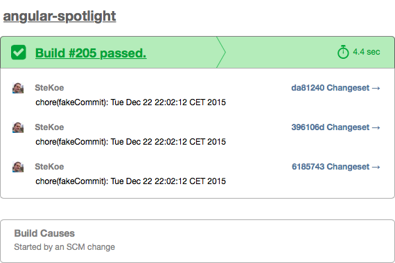
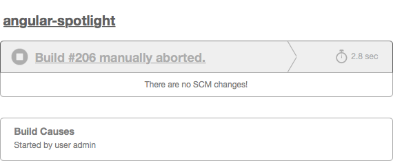
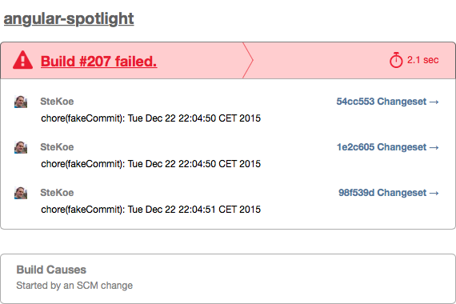

# jenkins-utils
This project contains some utilities for Jenkins CI including Groovy Scripts, email templates, etc.

## Email templates
The email-ext plugin of Jenkins allows one to use custom email templates.
To use a template, move the desired file to `$JENKINS_HOME/email-templates/email-template.template` and as email text insert `${SCRIPT, template="email-template.template"}`.

### Travis-like
This E-Mail template is adopted from Travic CI's emails send when a build has finished. It currently works just with Git and email-ext plugin.

## Groovy scripts

## admin-user.groovy
Sets up matrix authorization strategy and creates an admin user called `admin` having a default password `admin`.